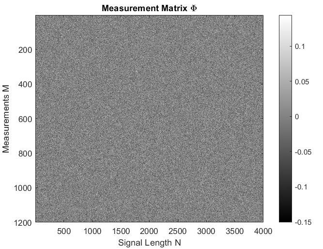
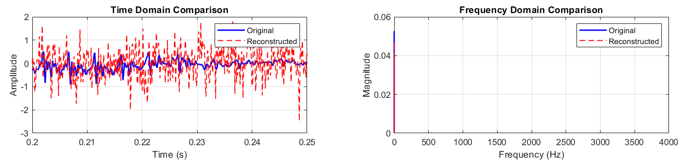
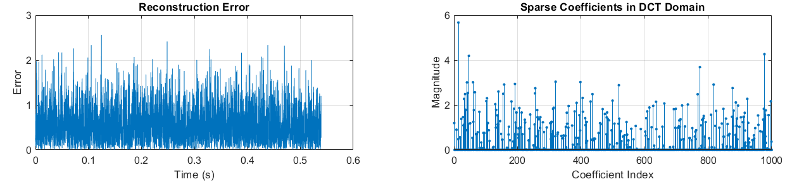
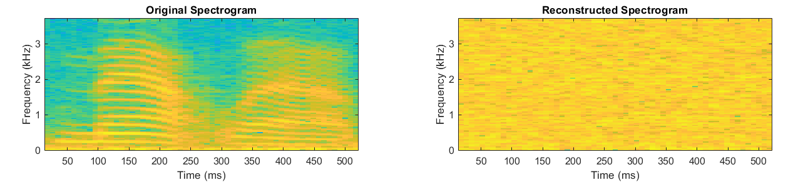

# Sparse Recovery in MATLAB

This repository contains MATLAB implementations of compressed sensing and sparse recovery experiments for signals, speech, and images.

The project studies how high-dimensional signals can be reconstructed from a smaller number of linear measurements when they are sparse or compressible in a suitable transform domain.

## Overview

Compressed sensing models the measurement process as

$$
y = \Phi x,
$$

where $x \in \mathbb{R}^N$ is the original signal, $\Phi \in \mathbb{R}^{M \times N}$ is the measurement matrix, and $y \in \mathbb{R}^M$ is the compressed measurement vector.

When $M \ll N$, the system is underdetermined. Recovery becomes possible by assuming that the signal has a sparse representation

$$
x = \Psi s,
$$

where $\Psi$ is a sparsifying basis and $s$ is a sparse coefficient vector.

The compressed sensing model then becomes

$$
y = \Phi \Psi s.
$$

The goal is to recover $s$ and reconstruct the signal as

$$
\hat{x} = \Psi \hat{s}.
$$

## Repository Structure

```text
sparse-recovery-matlab/
│
├── README.md
├── LICENSE
│
├── data/
│   └── cameraman100.jpg
│
├── src/
│   ├── demos/
│   │   ├── demo_two_tone_signal_l1_cvx.m
│   │   ├── demo_speech_dct_l1_reconstruction.m
│   │   └── demo_image_fft_thresholding.m
│   │
│   ├── algorithms/
│   │   └── omp_recovery.m
│   │
│   ├── experiments/
│   │   └── experimental_static_image_dct_omp.m
│   │
│   └── analysis/
│       └── analyze_time_frequency_domains.m
│
├── figures/
│   ├── speech_original_signal_spectrum.png
│   ├── speech_measurement_matrix.png
│   ├── speech_time_frequency_comparison.png
│   ├── speech_error_sparse_coefficients.png
│   ├── speech_spectrogram_comparison.png
│   └── cameraman_test_image.jpg
│
└── docs/
    └── Compressed_Sensing_Presentation.pptx
```

## Implemented Files

| File | Description |
|---|---|
| `src/demos/demo_two_tone_signal_l1_cvx.m` | Demonstrates sparse recovery of a synthetic two-frequency signal using random Gaussian measurements and L1 minimization with CVX. |
| `src/demos/demo_speech_dct_l1_reconstruction.m` | Applies compressed sensing to a speech signal using random Gaussian measurements, a DCT sparsifying basis, and L1 recovery. |
| `src/demos/demo_image_fft_thresholding.m` | Demonstrates image compressibility by keeping only the largest FFT coefficients and reconstructing the image. |
| `src/algorithms/omp_recovery.m` | Custom implementation of Orthogonal Matching Pursuit for greedy sparse recovery. |
| `src/experiments/experimental_static_image_dct_omp.m` | Experimental DCT-domain image reconstruction using random measurements and OMP. |
| `src/analysis/analyze_time_frequency_domains.m` | Compares audio and image signals in time/spatial and frequency domains. |

## Main Methods

### L1 Minimization

The main sparse recovery problem is

$$
\min_s \|s\|_1
\quad \text{subject to} \quad
\Phi \Psi s = y.
$$

This is a convex relaxation of the ideal sparsity problem

$$
\min_s \|s\|_0
\quad \text{subject to} \quad
\Phi \Psi s = y.
$$

The speech reconstruction script attempts several solvers:

1. `l1magic`, if available
2. CVX, if available
3. MATLAB `linprog` as a fallback

### Orthogonal Matching Pursuit

Orthogonal Matching Pursuit is implemented as a greedy alternative to L1 minimization.

At each iteration, OMP selects the column of the sensing matrix that is most correlated with the current residual. It then solves a least-squares problem over the selected columns and updates the residual.

OMP is usually faster than convex optimization, but it is more sensitive to the sparsity level, measurement matrix, and signal structure.

### Transform-Domain Sparsity

The project uses transform-domain sparsity to make recovery possible.

| Signal Type | Sparsifying Representation |
|---|---|
| Two-tone sinusoidal signal | Frequency/DCT-domain representation |
| Speech signal | DCT-domain representation |
| Image signal | FFT or DCT-domain representation |

The key idea is that many natural signals are not sparse in their original domain, but may become sparse or approximately sparse after a suitable transform.

## Speech Reconstruction Experiment

The main speech experiment reconstructs MATLAB's built-in speech signal from 30% of the original number of samples.

### Experiment Setup

| Quantity | Value |
|---|---:|
| Original signal length | 4001 |
| Compressed measurements | 1200 |
| Compression ratio | 0.30 |
| Sparsifying basis | DCT |
| Measurement matrix | Random Gaussian |
| Recovery method | L1 minimization |

### MATLAB Output

```text
Original signal length: 4001
Compressed measurements: 1200
Compression ratio: 0.3
Playing original speech...
Playing reconstructed speech...
Reconstruction time: 22.3702 seconds
Mean Squared Error: 0.47349
Signal-to-Noise Ratio: -10.1623 dB
```

### Interpretation

The reconstruction pipeline works technically: the signal is compressed, sparse coefficients are recovered, and a reconstructed signal is produced.

However, the quantitative results show that this particular setup does not recover the speech signal accurately. The MSE is relatively large and the SNR is negative, meaning the reconstruction error energy is larger than the useful recovered signal energy.

This is an important compressed sensing lesson: using fewer measurements is not enough by itself. The sparsifying basis, measurement matrix, solver, and signal structure must match well.

For this speech experiment, a global DCT basis with 30% random Gaussian measurements is not sufficient for high-quality reconstruction. Better performance may require a short-time transform, wavelet basis, learned dictionary, stronger sparsity model, or a larger number of measurements.

## Result Figures

### Original Speech Signal and Spectrum

<p align="center">
  
</p>

**Figure 1.** Original speech signal in the time domain and its frequency spectrum. The signal has structured frequency content, but it is not exactly sparse.

### Measurement Matrix

<p align="center">
  
</p>

**Figure 2.** Random Gaussian measurement matrix $\Phi$ used to compress the speech signal from $N = 4001$ samples to $M = 1200$ measurements.

### Time and Frequency Domain Reconstruction

<p align="center">
  
</p>

**Figure 3.** Time-domain and frequency-domain comparison between the original and reconstructed speech signal. The reconstructed signal does not closely match the original signal in this experiment.

### Reconstruction Error and Sparse Coefficients

<p align="center">
  
</p>

**Figure 4.** Reconstruction error over time and recovered DCT-domain coefficients. The error remains significant, showing that the recovered sparse representation is not accurate enough for high-quality reconstruction.

### Spectrogram Comparison

<p align="center">
  
</p>

**Figure 5.** Original and reconstructed spectrograms. The original spectrogram contains visible time-frequency structure, while the reconstructed spectrogram loses most of that structure.

### Test Image

<p align="center">
  
</p>

**Figure 6.** Cameraman image used in the image-based sparse reconstruction experiments.

## What the Results Show

The results show both the potential and the limitations of compressed sensing.

The successful parts are:

- Random compressed measurements were generated.
- A sparsifying basis was used to formulate recovery in a transform domain.
- L1 minimization and OMP-style sparse recovery were implemented.
- Time-domain, frequency-domain, error, coefficient, and spectrogram plots were produced.
- Quantitative metrics such as MSE, SNR, and reconstruction time were computed.

The limitations are:

- The speech reconstruction quality is poor for the current configuration.
- The reconstructed waveform differs significantly from the original waveform.
- The spectrogram comparison shows that important time-frequency structure is lost.
- The negative SNR confirms that the recovery is not reliable for this setup.

The main conclusion is that compressed sensing works best when the signal is highly sparse or compressible in the chosen basis. Speech is more naturally represented by local time-frequency methods than by one global DCT basis.

## How to Run

Open MATLAB in the repository root directory.

Run the speech reconstruction demo:

```matlab
run('src/demos/demo_speech_dct_l1_reconstruction.m')
```

Run the synthetic two-tone signal demo:

```matlab
run('src/demos/demo_two_tone_signal_l1_cvx.m')
```

Run the image FFT thresholding demo:

```matlab
run('src/demos/demo_image_fft_thresholding.m')
```

Run the time-frequency analysis script:

```matlab
run('src/analysis/analyze_time_frequency_domains.m')
```

Run the experimental static image reconstruction script:

```matlab
run('src/experiments/experimental_static_image_dct_omp.m')
```

## Requirements

- MATLAB
- Signal Processing Toolbox
- Optimization Toolbox for `linprog`
- CVX Toolbox, optional
- l1magic, optional

The speech reconstruction script attempts to use `l1magic` or CVX if available, but can fall back to MATLAB's `linprog`.

## Key Takeaways

<div align="center">

<table>
  <tr>
    <th>Concept</th>
    <th>Main Takeaway</th>
  </tr>
  <tr>
    <td><b>Compressed measurements</b></td>
    <td>A high-dimensional signal can be measured through fewer random linear projections.</td>
  </tr>
  <tr>
    <td><b>Sparsifying basis</b></td>
    <td>Recovery depends strongly on whether the chosen transform actually makes the signal sparse.</td>
  </tr>
  <tr>
    <td><b>L1 minimization</b></td>
    <td>L1 minimization gives a convex method for sparse coefficient recovery.</td>
  </tr>
  <tr>
    <td><b>OMP</b></td>
    <td>OMP is a faster greedy alternative, but it is sensitive to sparsity assumptions and measurement quality.</td>
  </tr>
  <tr>
    <td><b>Speech recovery</b></td>
    <td>The current speech experiment shows that a global DCT basis and 30% measurements are not enough for accurate recovery.</td>
  </tr>
  <tr>
    <td><b>Image recovery</b></td>
    <td>Images can be studied through FFT and DCT-domain sparsity, making them useful examples for sparse approximation.</td>
  </tr>
</table>

</div>

## License

This project is licensed under the MIT License.